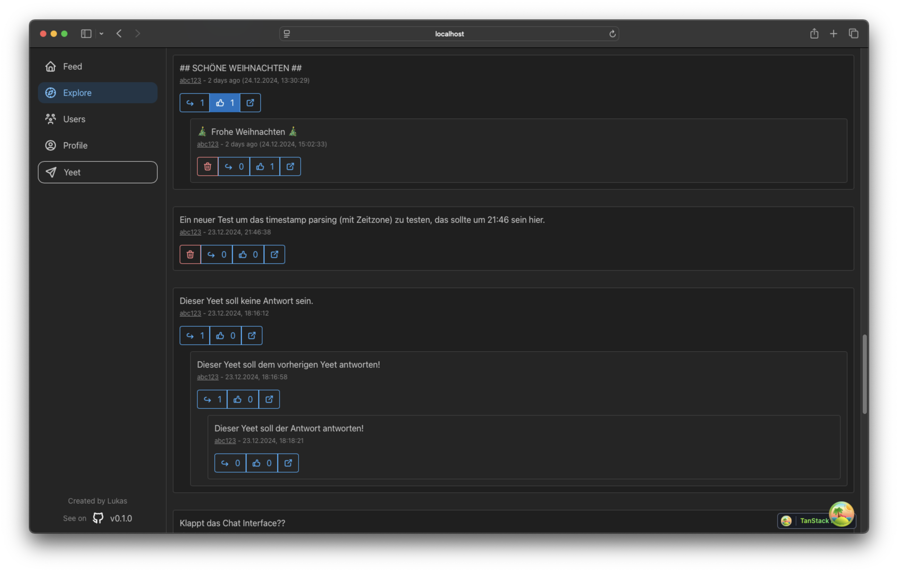

<!-- markdownlint-disable MD041 MD033 -->

    
    <h1 style="display: inline">YeetLand</h1>

 

YeetLand is a simple graphical interface for the Yeet Social network in the browser (uni project).

## ✨ Features

- Own Feed
- Explore all new yeets
- Like, create, reply to yeets
- See all users (including follow graph view)

## 🚀 Installation

TBA

## 🛠️ Development Setup

### 📋 Requirements

- Node.js
- Python

### 🧰 Tech Stack

- [React](https://reactjs.org/)
- [Vite](https://vitejs.dev/)
- [Mantine](https://mantine.dev/)
- [Flask](https://flask.palletsprojects.com/)
- [Python](https://www.python.org/)

### ⚙️ Setup

1. Copy the `prelude.py` file provided by the uni into this folder
2. Create a python venv via `python -m venv .venv`
3. Activate venv `source .venv/bin/activate`
4. Install python dependencies `pip install -r requirements.txt`
5. Install frontend dependencies via `npm install`
6. Start python server via `python web_client.py web`
7. And the frontend dev server via `npm run dev` in another terminal
